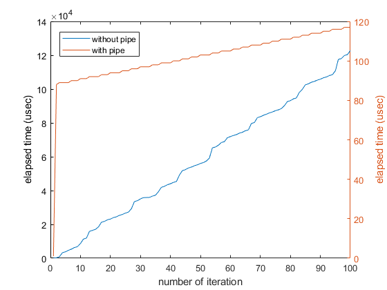

## System description
Tests are run in WSL under Windows 10 (10.0.18363 Build 18363).  
CPU: AMD Ryzen 5 3600 6-Core Processor, 3600 Mhz, 6 Core(s), 12 Logical Processor(s)  

## Timing

I used the system call `gettimeofday` to get the real time since epoch. The test code is in `gettimeofday_test.c`. This program has an odd behavior when used with a pipe in WSL under Windows (I have yet to test it on other systems). It outputs different timing behavoirs when being run directly and being run with a pipe

```bash
./gettimeofday_test.out
```
vs.
```bash
./gettimeofday_test.out | cat
```

The difference in time is plotted as shown  


Somehow the piped run takes shorter time (notice the axis scales are different).

## System call time

I get around 0.7us per system call to `read` for 0 byte length. See `measure_syscall.c` for implementation details.